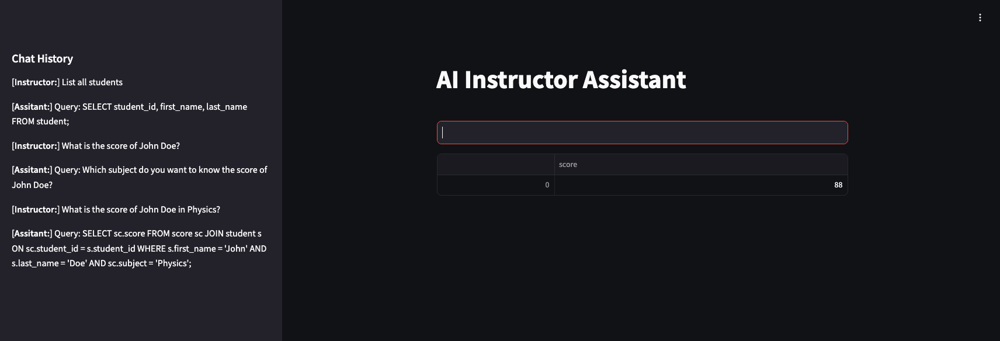

# AI Instructor Assistant

This is a simple AI assistant that can help instructors to manage the students' scores. The assistant can analyze the input data and interact with the PostgreSQL database. 



## Run the AI Assistant

To run the streamlit app, you can use the following command:

```bash
python3 -m venv venv
source ven/bin/activate
pip install -r requirements.txt

streamlit run main.py
```

## Further Steps

This version of the AI assistant is a simple prototype. You can extend it by adding more features and improving the current functionalities.

- It can be extended to combine the data from multiple LLM sources.
- To reduce the error rate, it can be interacted with LLM model in several times. Like, if the generated query is not correct, it can ask LLM model to generate the correct query again with the error information.
- To provide more complex queries, the vector db like `chroma` can be used for the zero-shot learning.
- The assistant can be extended to support more databases like MySQL, SQLite, MongoDB, etc.
